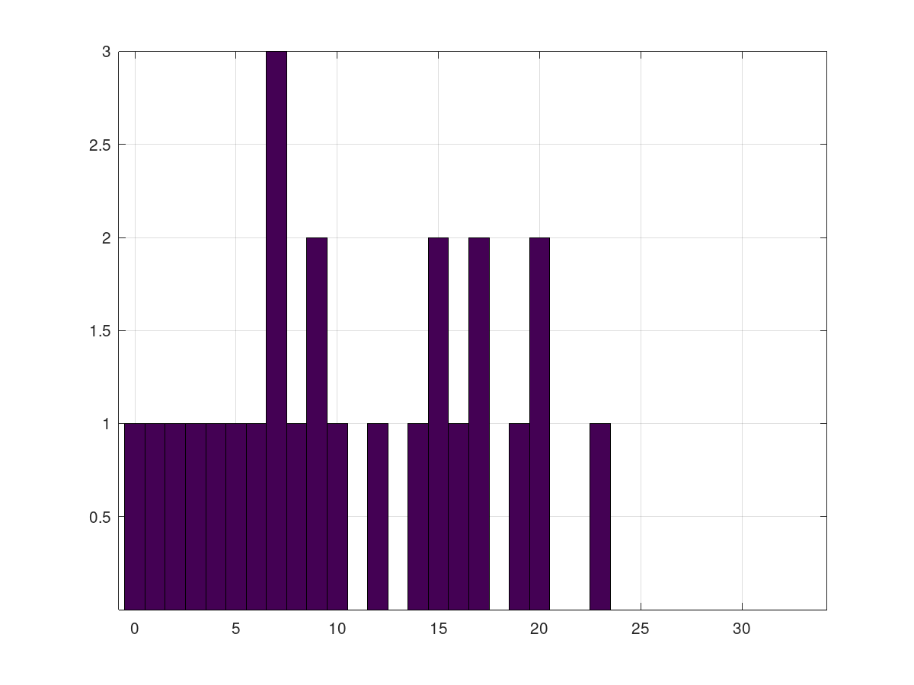

# haltProblem

An example of the halting problem, based on https://de.wikipedia.org/wiki/Halteproblem#Illustration.

### Relevant C++ Topics

- main argument parsing (could be done way better, but it works)
- file write, text mode

### Histogram

This is the output of `./haltProblem -m 25`:

```
res = [0, 1, 7, 2, 5, 8, 16, 3, 19, 6, 14, 9, 9, 17, 17, 4, 12, 20, 20, 7, 7, 15, 15, 10, 23];
hist(res)
```

In this case I used `hist(res, 0:1:25)` to achieve a higher resolution.


