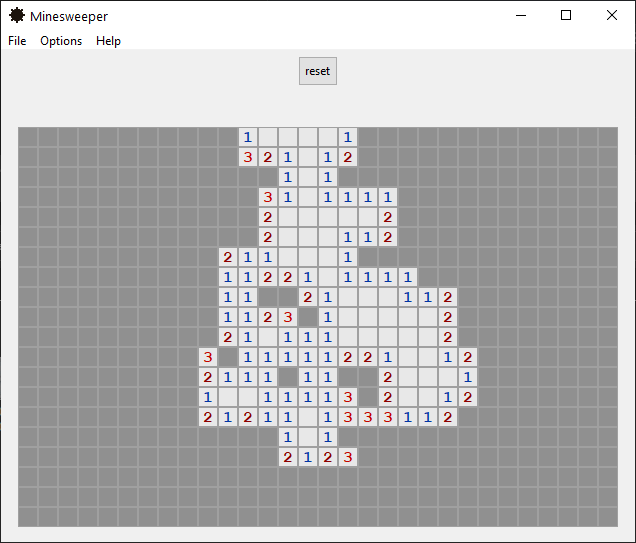

# Minesweeper

My first experience with wxWidgets. I chose Minesweeper to learn about custom controls, multiple windows, general form layouting and custom events in wxWidgets.

It's based on the great two videos of javidx9 ([1st](https://www.youtube.com/watch?v=FOIbK4bJKS8), [2nd](https://www.youtube.com/watch?v=FwUGeV2fnfM)). I added an automatic field discover method to discover empty fields.

> Only the non-flagging mode of the game is implemented

